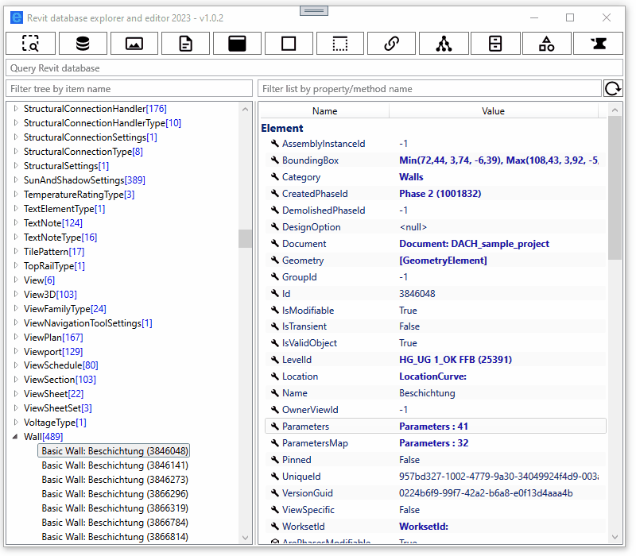
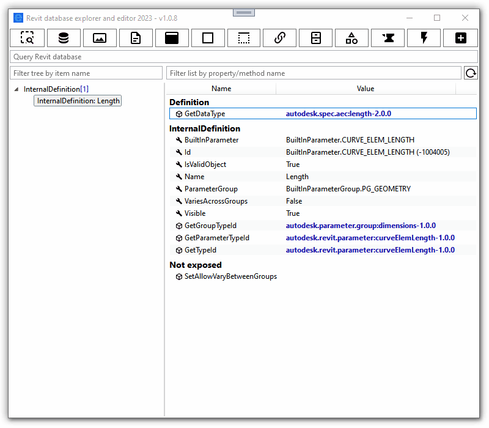
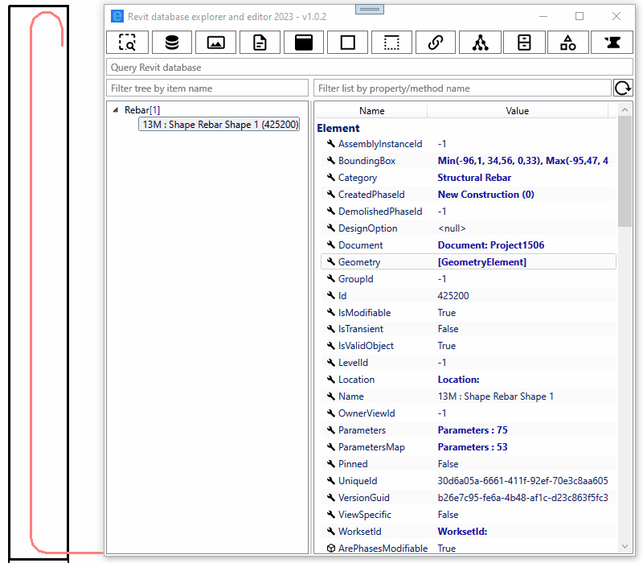
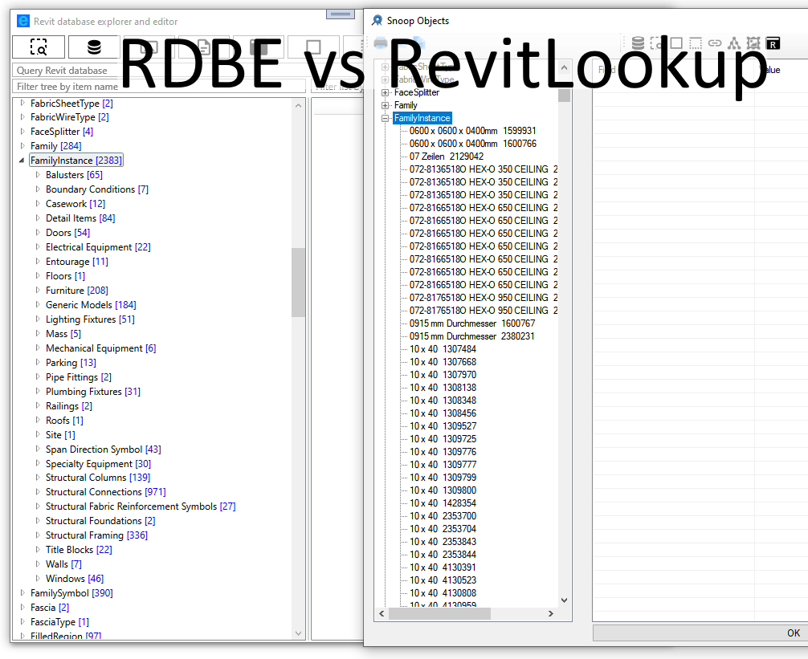

# Revit database explorer (RDBE)

Yet another [RevitLookup](https://github.com/jeremytammik/RevitLookup) clone. RevitLookup is a mature and indispensable tool to work with Revit. But its code had many authors and architectural changes(reflection, modeless) through time which led to quite significant technical debt and lack of consistency. For worse, its UI is still based on WinForms ... When I was adding support for [modeless windows #93](https://github.com/jeremytammik/RevitLookup/pull/93) to RevitLookup , I knew that at some point in time I will rewrite it whole. So here we are, let me introduce you to RDBE, a completely rewritten RevitLookup with WPF UI and a few small improvements:

- [query Revit database from UI](#possibility-to-query-Revit-database)
- [filterable tree of elements and list of properties and metohds](#filterable-tree-of-elements-and-list-of-properties-and-metohds)
- [tooltips with Revit documentation](#tooltips-with-revit-documentation)
- [extensive support for ForgeTypeId](#extensive-support-for-forgetypeid)
- [better support for Revit Extensible Storage](#better-support-for-revit-extensible-storage)
- [easier work with Element.Geometry](#easier-work-with-geometry)
- [more data exposed](#more-data-exposed)
- [elements of Family, FamilySymbol, FamilyInstance are grouped by category in tree](#grouping)

## Installation

- Download and install [RevitDBExplorer.msi](https://github.com/NeVeSpl/RevitDBExplorer/releases/latest/download/RevitDBExplorer.msi). Setup will instal RDBE for Revit 2022 and 2023.

## Features

### query Revit database (RDQ) from UI with RQL (Revit query language)

It is a very early version of this feature, but it can interpret words separated by `,` as element ids, Revit classes, categories and parameters. It builds from them FilteredElementCollector and uses it to query Revit database. The table with a description of RQL is below the example.

#### RQL - Revit query language
 
input/keywords | Interpretation | translates to in Revit Api
----------|------------| ----
`,`, `;` | seperates phrases/commands
`:` | [classifier](#classifiers)
`active`,  `active view` | select elements from active view | FilteredElementCollector(doc, doc.ActiveView.Id)
`type`,  `element type`,  `not element`  | select only types | .WhereElementIsElementType()
`element`,  `not element type`,  `not type` | select only elements | .WhereElementIsNotElementType()
e.g. `123456` - number | select elements with given id  | new ElementIdSetFilter(new [] {new ElementId(123456)})
e.g. `Wall` - revit class | select elements of given class | .OfClass(typeof(Wall)) or  new ElementMulticlassFilter()
e.g. `OST_Windows` - revit category | select elements of given category | .OfCategory(BuiltInCategory.OST_Windows) or  new ElementMulticategoryFilter()
`param = value` | a phrase that uses [any of the operators](#operators) is recognised as a search for a parameter (value)| new ElementParameterFilter()
`foo` - any not recognized text | wildcard serach for given text in parameters : Name, Mark, Type Name, Family and Type | ParameterFilterRuleFactory.CreateContainsRule(),   BuiltInParameter.ALL_MODEL_TYPE_NAME,  BuiltInParameter.ALL_MODEL_MARK,  BuiltInParameter.ELEM_FAMILY_AND_TYPE_PARAM,  BuiltInParameter.DATUM_TEXT

Queries are case-insensitive. Matching for categories/classes/parameters is done in a fuzzy way, you do not have to be very precise with names, but this may lead to some false positive results. 

A value you are searching for is not parsed/interpreted (yet), which means that it uses internal Revit storage units/form, not Revit UI units. For parameters that have StorageType.String, you can do wildcard search by using `%` or  `*` at the beginning and/or end of searching text e.g. `Mark = *foo%`

classifier | meaning
-----------|-------
`id:[text]`, `ids:[text]` | interpret `[text]` as ElementId
`category:[text]`, `cat:[text]` | interpret `[text]` as BuiltInCategory
`type:[text]`, `class:[text]`, `typeof:[text]` | interpret `[text]` as element type/class
`name:[text]` | 

operator | meaning | example
-|-|-
`!=`, `<>` | NotEquals | `Length != 0`
`>=` | GreaterOrEqual | `Length >= 0`
`<=` | LessOrEqual | `Length <= 0`
`??` | HasNoValue, parameter exists but has no value | `Length ??`
`!!` | HasValue, paramater exists and has value | `Length !!`
**`?!`** | **Exists, element has given parameter**| `Length ?!`
`=` | Equals | `Length = 0`
`>` | Greater | `Length > 0`
`<` | Less | `Length < 0`

### filterable tree of elements and list of properties and metohds

### tooltips with Revit documentation

They are problems with loading some of tooltips, but most of them should work.

### extensive support for ForgeTypeId

We all love (or hate) the ForgeTypeId, RDBE exposes all data related to a given ForgeTypeId scattered through many utils. You can also snoop all ForgeTypeIds returned from: 
- ParameterUtils.GetAllBuiltInGroups
- ParameterUtils.GetAllBuiltInParameters
- UnitUtils.GetAllMeasurableSpecs
- UnitUtils.GetAllDisciplines
- SpecUtils.GetAllSpecs
-  UnitUtils.GetAllUnits

### better support for Revit Extensible Storage

RDBE allows you to snoop all schemas that are loaded into Revit memory, and you can easily get all elements that have an entity of a given schema. You get access to an Extensible Storage data exactly like through RevitApi, by invoking: Element.GetEntity(). In contrast to Revit Lookup, you will only see entities that you can read and really exist in a given element. (Revit Lookup shows an exception when cannot access an entity even when an entity does not exist in a given element....)

### easier work with Element.Geometry

Not only you have faster access to a geometry of an element, but you can also select an instance of GeometryObject in Revit if it has a valid reference.  

### more data exposed from Revit database

In comparison to RevitLookup, RDBE in addition gives access to:

- Category
    - IsBuiltInCategory
    - GetBuiltInCategory
    - GetBuiltInCategoryTypeId
- Document
    - GetTypeOfStorage
- FormatOptions
    - GetValidSymbols
    - CanHaveSymbol
- **HostObject**
    - **FindInserts**
- **JoinGeometryUtils**
    - **GetJoinedElements**
    - **IsCuttingElementInJoin** 
- LabelUtils
    - GetLabelForBuiltInParameter
    - GetLabelForGroup
    - GetLabelForUnit
    - GetLabelForSpec
    - GetLabelForSymbol
    - GetLabelForDiscipline
- ParameterUtils
    - IsBuiltInParameter
    - GetBuiltInParameter
    - IsBuiltInGroup
    - GetBuiltInParameterGroup
- Rebar
    - DoesBarExistAtPosition 
    - **GetCenterlineCurves** 
    - GetCouplerId 
    - GetEndTreatmentTypeId 
    - **GetFullGeometryForView**
    - GetHookOrientation
    - GetHookRotationAngle
    - GetHookTypeId
    - **GetMovedBarTransform**
    - **GetTransformedCenterlineCurves**
    - IsBarHidden
- UnitFormatUtils
    - Format
- UnitUtils
    - IsMeasurableSpec
    - IsSymbol
    - IsUnit
    - GetDiscipline
    - GetTypeCatalogStringForSpec
    - GetTypeCatalogStringForUnit
    - GetValidUnits
- SpecUtils
    - IsValidDataType
    - IsSpec

### elements of Family, FamilySymbol, FamilyInstance are grouped by category in the tree

